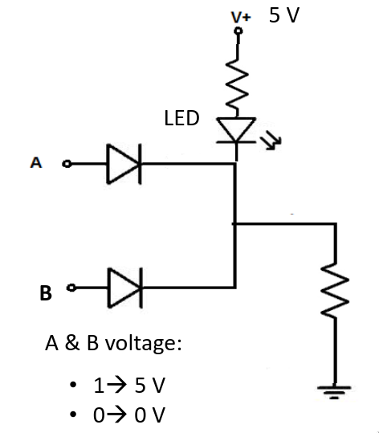
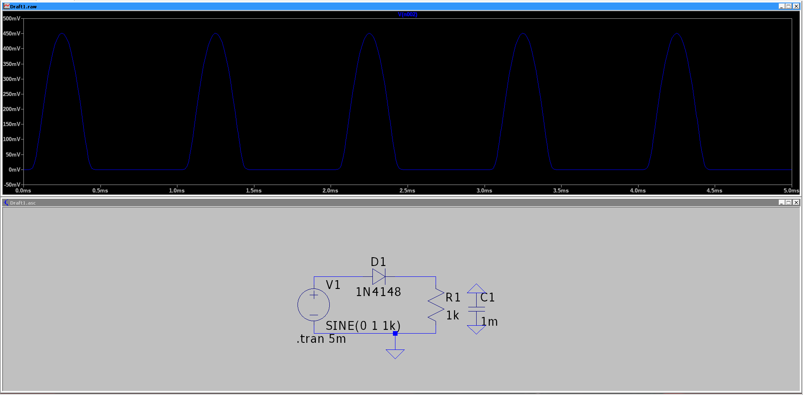
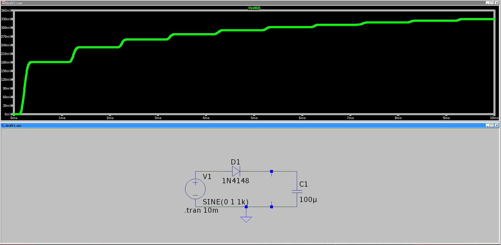
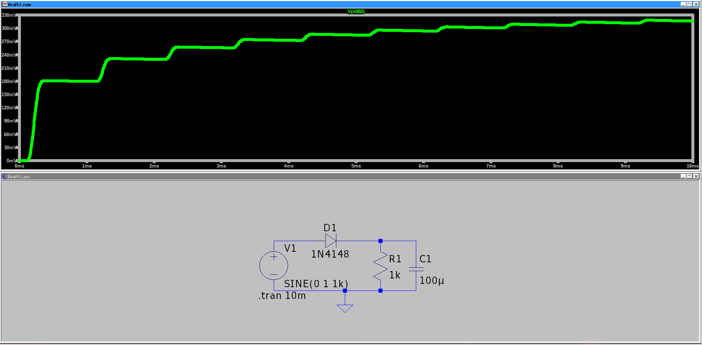

# Assignents

## A logic circuit is shown in Fig. 1. The voltage drops of the diodes connected to A and B are 0.7 V and the voltage drop of the LED is 2 V.

 - When A is connected to 0 V and B to 0 V, is the LED on or off? Why?
    - yes, because there is a 5 volt voltage diff over the LED
 - When A is connected to 0 V and B to 5 V, is the LED on or off? Why?
    - no, the Voltage from B makes the voltage diff over the LED 0V
 - When A is connected to 5 V and B to 0 V, is the LED on or off? Why?
    - no, the Voltage from A makes the voltage diff over the LED 0V
 - When A is connected to 5 V and B to 5 V, is the LED on or off? Why?
    - no, the voltage from A and B makes the voltage diff over the LED -5V, but because it is a diode it blocks reverse power
 - What logic gate is it?
    - this is a nor gate

|A|B|LED|
|-|-|---|
|0|0| 1 |
|0|1| 0 | 
|1|0| 0 |
|1|1| 0 |

## Half-wave rectifier LT spice simulation: $V_{in}=4\cdot sin(2\pi 50t)$, diode 1N4007, $R=1K\Omega$ and C=0.001F plot the voltage across the resistor for the following cases: 

1. Half-wave rectifier with a resistor R.

2. Half-wave rectifier with a capacitor C.

3. Half-wave rectifier with a capacitor C and a resistor R.

4. Half-wave rectifier with a capacitor C and a resistor R. Change the capacitance of the capacitor, i.e., change the value of C, to make
the output signal smoother
  + making the Cap bigger would cause the signal to be smoother however more power would be lost in the cap

## Full-wave rectifier LT spice simulation: $V_{in}=4\cdot sin(2\pi 50t)$, diode 1N4007, $R=1K\Omega$ and C=0.001F plot the voltage across the resistor for the following cases: 

1. Full-wave rectifier with a resistor R.
2. Full-wave rectifier with a capacitor C.
3. Full-wave rectifier with a capacitor C and a resistor R.
4. Full-wave rectifier with a capacitor C and a resistor R. Change the capacitance of the capacitor, i.e., change the value of C, to make
the output signal smoother
