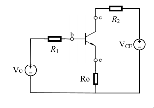
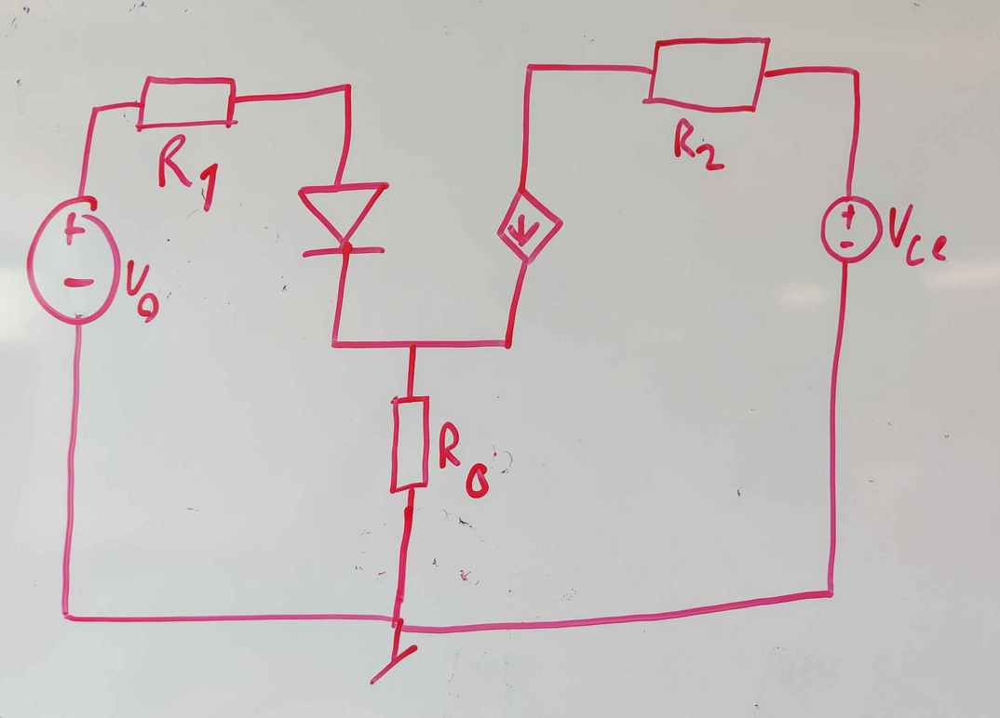

# lecture 05

## 1. A bipolar transistor has a collector current of 1mA and IS= 5 ×10⁻¹⁶ A:

### How much is VBE? If β = 50
$$V_t = 26mV$$
$$I_c = I_s \cdot e^{\frac{V_{be}}{V_t}} = 5 \cdot 10^{-16} e^{\frac{V_{be}}{26\cdot 10^{-3}}}$$
Solve for Vbe gets you
$$Vbe = 0.736V$$

### How much is base current?

$$ I_B = \frac{I_c}{\beta} =  \frac{1\cdot 10^{-3}}{50} = 20 \cdot 10^{-6} A$$

## 2. Please draw the simple model of the following circuit:

## 3. 3. If Vo = 5 V, Ro = 100 Ω, VCE = 12 V, R1 = 200 Ω, R2 = 100 Ω, β = 50, please calculate collector current? (Just give the final formula, not need to calculate the exact value).

You can create 2 formulas with 2 unkown by using Kirchoffs circuit law

$$
V_0=I_1\cdot R_1+ I_1 \cdot R_2 +0.7 = 5V = I_1 \cdot 200\Omega + I_1 \cdot 100\Omega + 0.7
$$
$$
V_{ce} = I_c \cdot R_2 \cdot R_0 = 12V =  I_c \cdot 100\Omega + I_c \cdot 100\Omega
$$

solving these 2 equations gives us an $I_1 = 14\cdot 10^{-3}A$ and $I_c=60 \cdot 10^{-3}$

