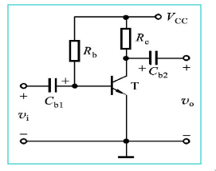
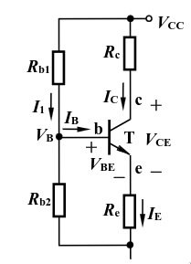
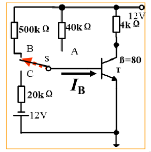
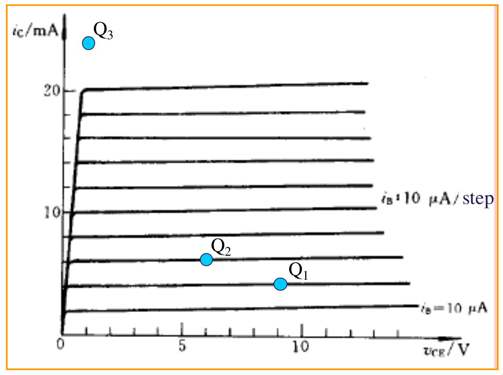
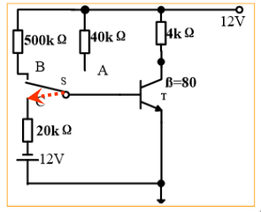

# For a BJT-based amplification circuit, we measure the voltage of VCE, and find its value approximately equal to VCC, please evaluate the operating state of the circuit and also list the possible reasons resulting in the phenomenon. 

$$V_{ce} \approx V_{cc}$$

Operating state:
    Transistor is in cutoff since ther is no voltage drop across Rc

Possible reasons:
    The base voltage is too low to turn on transistor

# Give the formulae to calculate the Q point of the following circuit? (I1 >>IB)

To find the Q point the the $I_C$ and the $I_B$.

To find $I_b$ we will first find $R_b$.
This can be done with the formula

$$R_B=\frac{R_{b1}\cdot R_{b2}}{R_{b1}+R_{b2}}$$

the voltage at the base to ground can be found with
$$V_{BB} = V_{CC}(\frac{R_{b2}}{R_{b1}+R_{b2}})$$

now the current running into the base can be calculated

$$I_B=\frac{V_{BB}-V_{BE}}{R_B}$$

remember that $V_{be} \approx 0.7V$ when the transistor is silicon based

$I_c$ can then be calculated with:
$$I_C=\beta \cdot I_B$$

because
$$\beta = \frac{I_c}{I_b}$$

# Calculate the Q point of the following circuit and also evaluate what region does the transistor operate? (VBEQ = 0.6 V)

We can do what we just did in the last assignment with the values from the picture
we get
$$I_B=22.8\mu A$$
$$I_C=1.82mA$$
$$V_{ce}=4.7V$$
Now the q can be found from this graf

$$Q(22.8\mu A , 1.82mA 4.7V)$$

# Please evaluate what region does the transistor operate and calculate the Q point of the following circuit (VBEQ = 0.6 V) 

