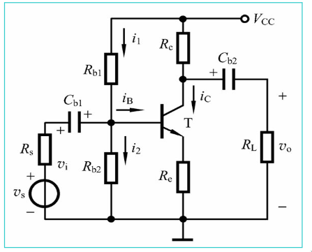
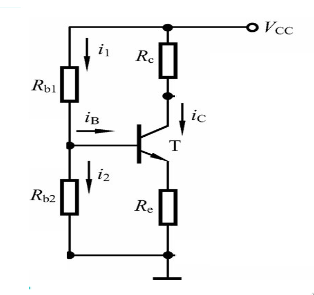

# Lecture 07 assignments

## For the following circuit, Vcc = 16 V, Rb1 = 56 kΩ, Rb2 = 20 kΩ, Re = 2 kΩ, Rc = 3.3 kΩ, RL = 6.2 kΩ, Rs = 500 Ω, β = 80, VBEQ = 0.7 V.


### Draw its corresponding DC circuit, and calculate the Q operating point.



the Q point is defined by 3 parameters
Q(Ib,Ic,Vce)
so to find the q point we have to fint the collector current the base current and the collector emitter voltage


```{Python}
import math
Vcc = 16 
Rb1 = 56 * math.pow(10,3)
Rb2 = 20 * math.pow(10,3)
Re = 2 * math.pow(10,3)
Rc = 3.3 * math.pow(10,3)
RL = 6.2 * math.pow(10,3)
Rs = 500

hfe = 80
```

### Draw its corresponding small-signal model, and calculate Ri, Ro, and Av.


### If a capacitor with a value of 50μF is parallel with Re, please calculate (a) and (b) again.


