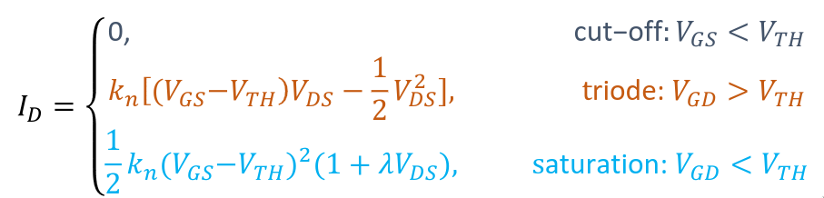
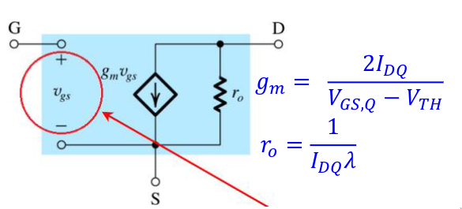
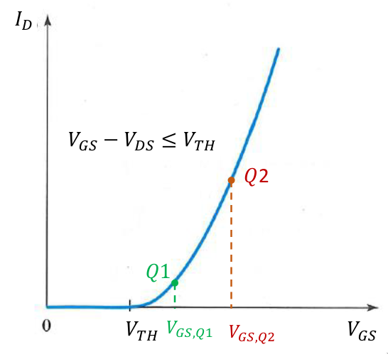
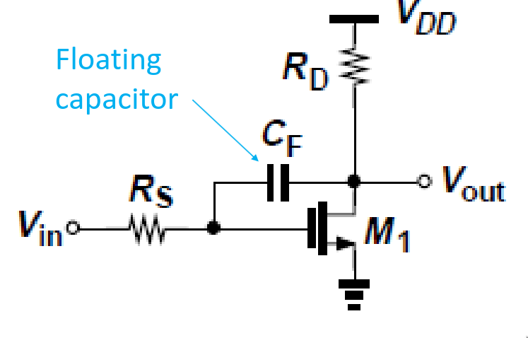
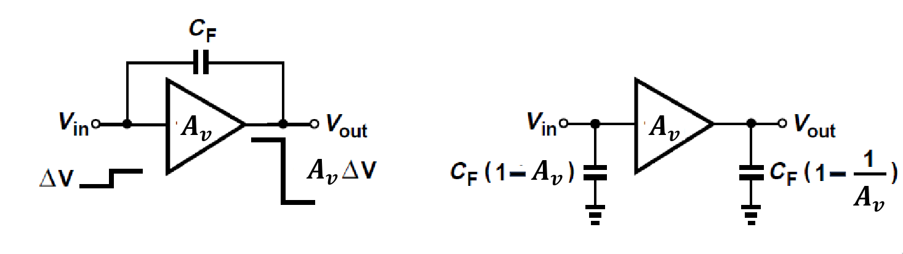

# Mosfets

smaller less power consumed and easier to produce

FET = field effect transistor
MOS = metal oxide semiconductor
metal oxide used as insolator on gate.

Transistor |    in    |    control   |   out    |
-----------|----------|--------------|----------|
 P-type    | source   |     gate     |    Drain |
 N-type    | Drain    |     gate     |    Source|
  bjt      |collector |    base      |   emitter|

mosfet can be used as a coltage controlled resistor, by not having it be all the way in the saturation(active) region

## small signal model of MOSFET

Q2 better for amplification

the steeper the graf the better amplification ( however this comes at the cost of more biasing voltage, meaning we have to use more power)

input impedance of mosfet gate is VERY HIGH! pretty much infinite

## frequency response

because the mosfet has capacative load it will function as a filter.
this is propably not desirable in your amplifier, so be aware of where poles of your filter are.

remember from bodeplots that ZERO points are places where your filter will increase 20db pr decades and poles decrease

## floating capacitors

by having the cap in the feedback of an amplifier we can get 2 poles for the price of 1 :P
