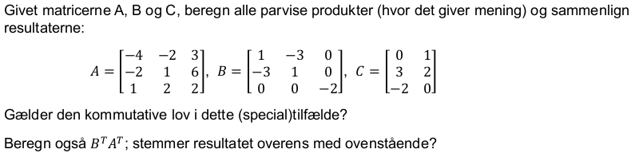
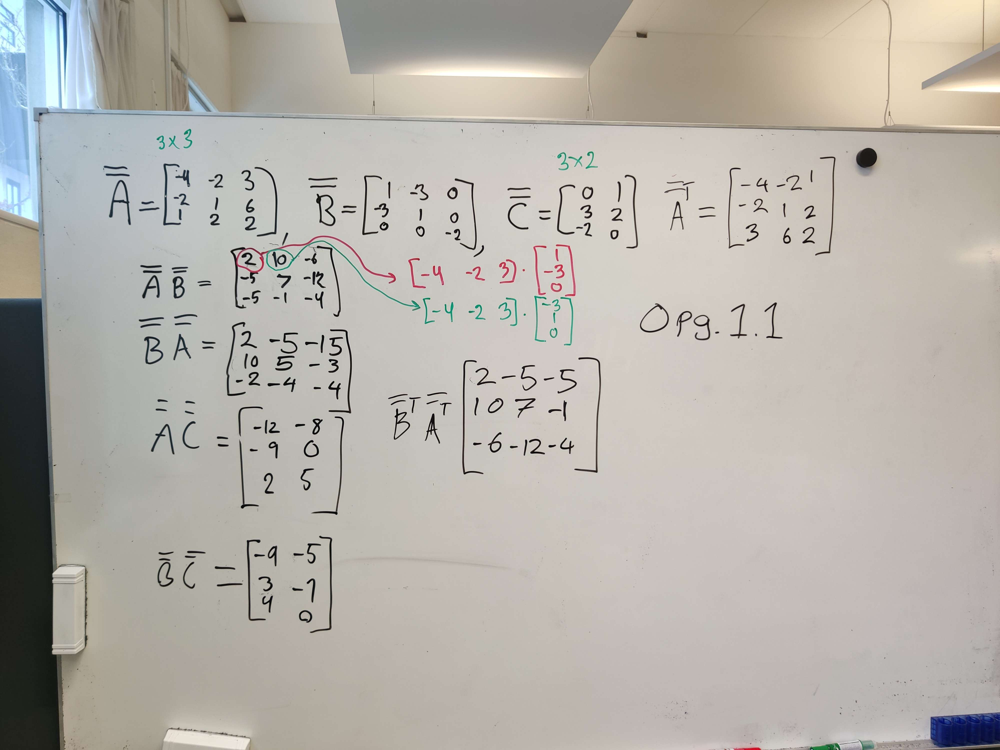
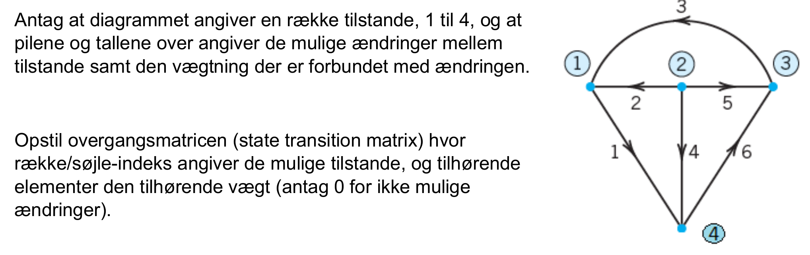
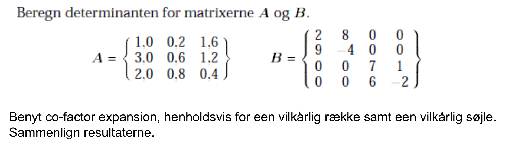
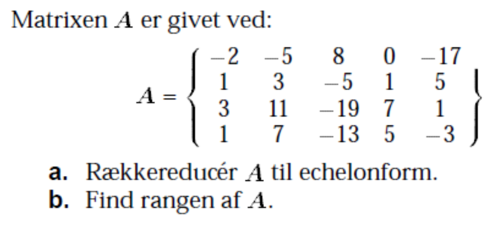

# Exercise 1.1



**Calculation for checking:**
```py
import numpy as np
A = np.asarray([[-4, -2, 3], [-2, 1, 6], [1, 2, 2]])
B = np.asarray([[1, -3, 0], [-3, 1, 0], [0, 0, -2]])
C = np.asarray([[0, 1], [3, 2], [-2, 0]])
print("AB")
print(np.matmul(A,B))
print("BA")
print(np.matmul(B,A))
print("AC")
print(np.matmul(A,C))
print("BC")
print(np.matmul(B,C))
print("BT AT")
print(np.matmul(np.transpose(B), np.transpose(A)))
```
**Output:**
```py
AB
[[  2  10  -6]
 [ -5   7 -12]
 [ -5  -1  -4]]
BA
[[  2  -5 -15]
 [ 10   7  -3]
 [ -2  -4  -4]]
AC
[[-12  -8]
 [ -9   0]
 [  2   5]]
BC
[[-9 -5]
 [ 3 -1]
 [ 4  0]]
BT AT
[[  2  -5  -5]
 [ 10   7  -1]
 [ -6 -12  -4]]
```



# Exercise 1.2



# Exercise 1.3



**Calculation for checking:**
```py
import numpy as np
A = np.asarray([[1.0, 0.2, 1.6], [3.0, 0.6, 1.2], [2.0, 0.8, 0.4]])
B = np.asarray([[2, 8, 0, 0], [9, -4, 0, 0], [0, 0, 7, 1], [0, 0, 6, -2]])
print(f"{np.linalg.det(A)=}")
print(f"{np.linalg.det(B)=}")
```
**Output:**
```py
np.linalg.det(A)=1.4400000000000006
np.linalg.det(B)=1599.9999999999998
```


# Exercise 1.4



a.
1. Subtract row 4 from row 2
2. Multiply row 4 with 2 and add to row 1
3. Multiply row 4 with -3 and add to row 3
4. Multiply row 2 with -2.5 and add to row 3
5. Divide column 3 with 2 and add to column 2
6. Divide row 1 with 2.25 and add to row 2
7. Multiply row 2 with 2.25
8. Divide row 3 with 2 and subtract from row 2
9. Swap row 1 and row 4. Now r=1
10. Swap row 2 and row 4. Now r=2


