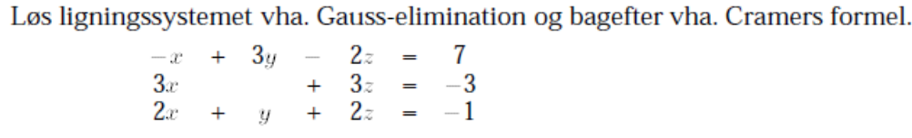
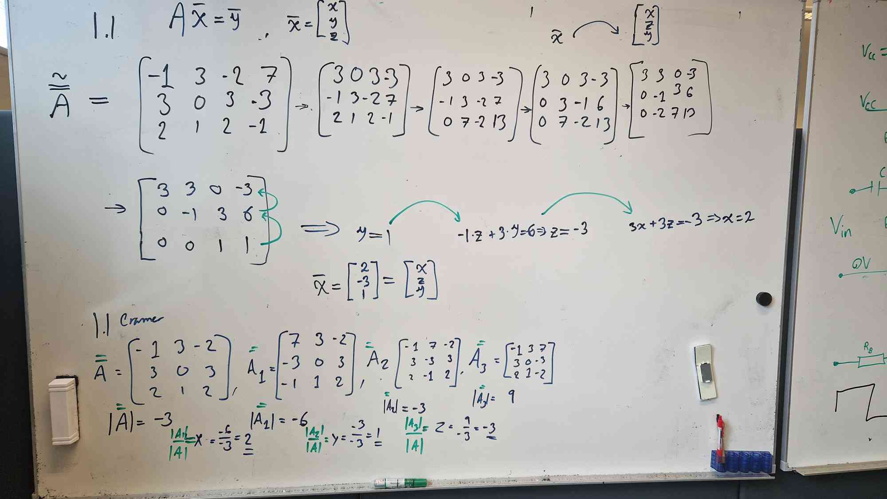
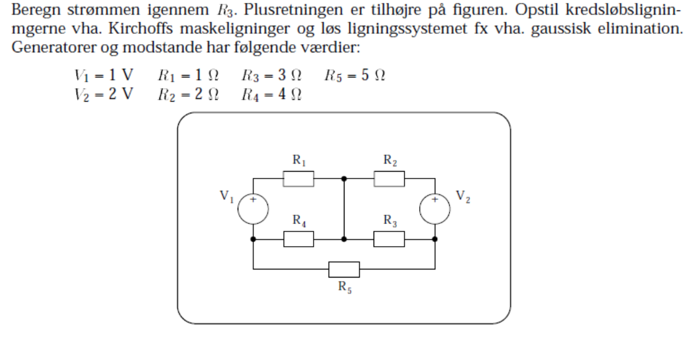
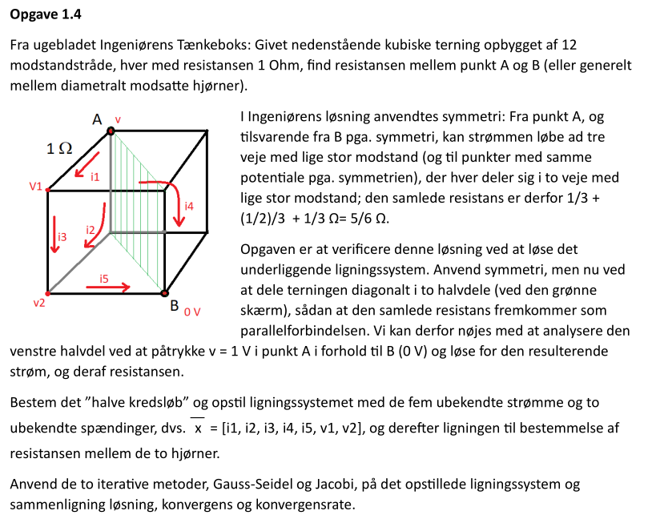
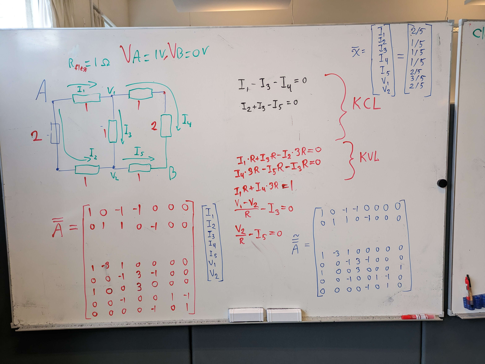

# Exercise 1.1



1. Swap row 1 and 2
2. Add 2 times row 2 to row 3
3. Add row 1 divided by 3 to row 2
4. Swap column 2 and 3
5. Add row 2 times -2 to row 3



# Exercise 2.3



**Solution:**
```matlab
A = [1 1 -1 0 0 0 0; 0 0 1 -1 -1 0 0; -1 0 0 1 0 1 0; 0 -1 0 0 1 -1 0; -1 0 0 -4 0 0 1; 0 -2 0 0 -3 0 2; 0 0 0 4 3 5 0];
solution = rref(A)
```
**Output:**
```
solution =

    1.0000         0         0         0         0         0    0.0963
         0    1.0000         0         0         0         0   -0.6222
         0         0    1.0000         0         0         0   -0.5259
         0         0         0    1.0000         0         0   -0.2741
         0         0         0         0    1.0000         0   -0.2519
         0         0         0         0         0    1.0000    0.3704
         0         0         0         0         0         0         0
```

# Exercise 2.4



**Solution:**
```py
import sympy
import numpy as np
A = np.asarray([[1,0,-1,-1,0,0,0,0],[0,1,1,0,-1,0,0,0],[1,-3,1,0,0,0,0,0],[0,0,-1,3,-1,0,0,0],[1,0,0,3,0,0,0,1],[0,0,-1,0,0,1,-1,0],[0,0,0,0,-1,0,1,0]])
print(sympy.Matrix(A).rref()[0])
```
**Output:**
```py
Matrix([
[1, 0, 0, 0, 0, 0, 0, 2/5],
[0, 1, 0, 0, 0, 0, 0, 1/5],
[0, 0, 1, 0, 0, 0, 0, 1/5],
[0, 0, 0, 1, 0, 0, 0, 1/5],
[0, 0, 0, 0, 1, 0, 0, 2/5],
[0, 0, 0, 0, 0, 1, 0, 3/5],
[0, 0, 0, 0, 0, 0, 1, 2/5]])
```


