## Eksame sæt

### Opg 1
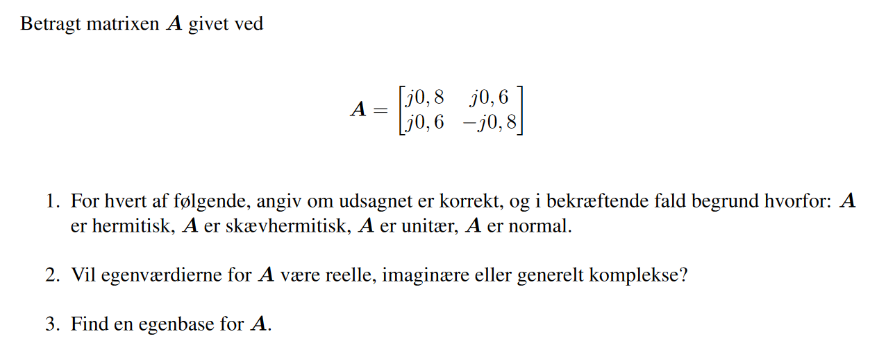

#### 1.

Hermitisk er en kompleks matrix.
Skævsymmetrisk brug "complex conjugate" $-\bf{A} = \bf{A}^H$

Så konjugere man:
$$A^H = (A*)^T$$

$$
A^* = \begin{bmatrix}
-j0.8 & -j0.6\\
-j0.6 & +j0.8
\end{bmatrix}
$$

$$
A^T = \begin{bmatrix}
-j0.8 & -j0.6 \\
-j0.6 & +j0.8
\end{bmatrix}
$$

$$
-A = \begin{bmatrix}
-j0.8 & -j0.6 \\
-j0.6 & +j0.8
\end{bmatrix}
$$

Udfra det overstående ses der et den er Skævhermitisk.

**Check om matrixen er normal ved dette:**
$$\bf{A}^H\bf{A}=\bf{A}\bf{A}^H$$

Svaret er ja!

**Check om hermitiske:**

$$ \bf{A} = \bf{A}^H$$

Resten af mulighederne passer ikke så den er normal og Skævhermitisk.

**Liste af identiteter:**

Unitary matrix:
$U^H = U^{-1}$

Inverse af en matrix to måder:

Første:

$[\bf{A} | \bf{I}]$ hvor man udfører row operation på dem begge så får man til sidst ->
$[I | A^{-1}]$

Anden er noget mere involveret:
$adj(\bf{A})/det(\bf{A})$

Den inverse af matrix eksitere kun hvis matrix er square og determinanten er $\neq 0$
bliver til 1 række istedet hvorimod søjlen for med 4 i bliver til en række for 4.

Transpose example:

Du tager diagonalen altså $1 \: 4$ og ligger søjlen under 1 op så det bliver til 1 række istedet hvorimod søjlen for med 4 i bliver til en række for 4.

$$
B = \begin{bmatrix}
 1 & 2 \\
 3  & 4 \\
 5 & 6 
\end{bmatrix}^T
= \begin{bmatrix}
 1 & 3 & 5\\
 2 & 4 & 6
\end{bmatrix}
$$

$$
A = \begin{bmatrix}
j0.8 & j0.6 \\
j0.6 & -j0.8
\end{bmatrix}
,\:
A^T = \begin{bmatrix}
j0.8 & j0.6 \\
j0.6 & -j0.8
\end{bmatrix}
$$

#### 2.

De vil være imaginære fordi skæv hermitiske matrixer altid giver imaginære egenværdier eller 0 og 0 er ikke et svar.

#### 3.

Så udregn eigenværdierne og løs for dens eigen vektore men det giver et anderledes svar end givet dette er meningen troels vælger en anden værdi for eigen vektor.


Determinant eksempel for 2x2 matrix:
$$ A =\begin{bmatrix} a & b \\ c & d \end{bmatrix}\\ =|A| =ad-bc $$

Eigenvalue:
$$det(A-\lambda I) = 0$$

$$
det(
\begin{bmatrix}
j0.8 & j0.6 \\
j0.6 & -j0.8
\end{bmatrix} -
\begin{bmatrix}
\lambda & 0 \\
0 & \lambda
\end{bmatrix}
) = 0\\=det(
\begin{bmatrix} j0.8-\lambda & j0.6\\j0.6 & -j0.8-\lambda \end{bmatrix}
) = 0\\ =
\lambda^2+1 = 0
$$
Løs for rødderne $\lambda$: $\lambda_1 = j$, $\lambda_2 = -j$

Eigenspace/eigenvector:
$$E = {\vec{v}:\: (A-\lambda I)\vec{v} = 0}$$

Sæt $\lambda$ værdierne ind og løs for $\vec{v} = [x_1,x_2]^T$

for $\lambda_1$

$$
\begin{bmatrix} -j0.8 - j & j0.6 \\ j0.6 & -j0.8 - j \end{bmatrix}
\begin{bmatrix} x_1 \\ x_2 \end{bmatrix} = 0
$$

$$
\begin{bmatrix} -j0.2 & j0.6\\j0.6 & -j1.8 \end{bmatrix}\begin{bmatrix} x_1\\x_2\end{bmatrix}=0
$$

Hernæst udfør gaussisk elimination:
$$
\begin{bmatrix} -j0.2 & j0.6 & 0\\j0.6 & -j1.8 & 0\end{bmatrix}\begin{bmatrix} x_1\\x_2\end{bmatrix} 
\overset{r_2=3r_1+r_2}{\longrightarrow} \begin{bmatrix} -j0.2 & j0.6 & 0 \\ 0 & 0 & 0\end{bmatrix}\begin{bmatrix} x_1\\x_2\end{bmatrix}
\overset{r_1=5r_1 + r_1}{\longrightarrow}\\
$$
$$
\begin{bmatrix}
    1 & -3 & 0\\
    0 & 0 & 0
\end{bmatrix}
\begin{bmatrix} x_1\\x_2\end{bmatrix}
$$

$x_2$ kan vælges frit til 1 eftersom at $x_2$ har ingen pivot og er derfor en fri variabel.

$$1\cdot x_1 -3(1) = 0 \Leftrightarrow x_1 = 3$$

$x_1$ er så 3 deraf er eigenvektor eller en basis: $v_1 = [3,1]^T$

Samme procedure for $\lambda_2$ hvilket giver: $[-0.33, 1]^T$ hvilket stemmer overens med svarene!(troels vælger bare $x_2$ til 3 ) 

For at checke om dine svar rigtig brug:
$\bf{A}\vec{x} = \lambda \vec{x}$

$\vec{x}$ er eigenvector til den $\lambda$ du vil sætte ind.

### Matlab
```Matlab
A = [j*0.8 j*0.6; j*0.6 -j*0.8];
%Use conjugate transpose | A' or ctranspose(A)

if -A == A' 
    x = 'skewsymm'
else A == A'
    z = 'symm'
end
if A'*A == A*A'
    y = 'yes normal'
end
%% 3
A = [j*0.8 j*0.6; j*0.6 -j*0.8];
syms x y;
%Hurtig måde for eigen værdier og vektore!
[vA, eA] = eig(A)
%løs den på den langsomme måde
q = ((j*0.8-x).*(-j*0.8-x)) - (j*0.6.*j*0.6);
expand(vpa(q));
vpa(solve(q,x)); %løser for rødderne

%Langsom måde for eigenvektor
v1 = A - (eA(1)*eye(2));
v2 = A - (eA(4)*eye(2));
rref(v1); % vælg x2 = 1 og løs for x1 hvilket er 3 her
rref(v2); % vælg x2 = 1 og løs for x1 hvilket er -0.333 her
x1 = [3; 1];
x2 = [-0.333; 1] %svar på eigen base
```

### Opg 2

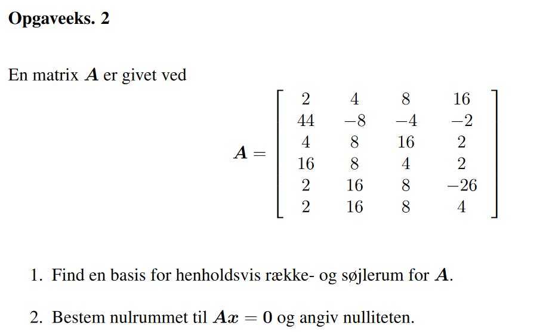

#### 1.

$$
A=\begin{bmatrix}
2 & 4 & 8 & 16 \\ 
44 & -8 & -4 & -2 \\ 
4 & 8 & 16 & 2 \\ 
16 & 8 & 4 & 2 \\ 
2 & 16 & 8 & -26 \\ 
2 & 16 & 8 & 4
\end{bmatrix}
$$

**Basis for søjlerum:**
Det er de 4 søjler i matrixen som udgør en basis for søjlerummet.
Dette kan findes ved hjælp af row reduktion og tælle antal pivots der kommer.
I dette tilfælde har alle søjler en pivot ergo fuld rank.

Row reduktion:

Begyndelse på row reduktion:

$$
A =
\begin{bmatrix}
1 & 0 & 0 & 0  \\
0 & 1 & 0 & 0  \\
0 & 0 & 1 & 0  \\
0 & 0 & 0 & 1  \\
0 & 0 & 0 & 0  \\
0 & 0 & 0 & 0 
\end{bmatrix}
$$


**Basis for rækkerum:**
For rækkerum så det row reduktion igen og alle de rækker som kun har 0 kan ikke vælges som en basis for rækkerum.

Så det er række $r_1, r_2, r_3, r_4$

#### 2.

$$
\bf{A}\vec{x} = \vec{0}
$$

Udfra row reduktion fra 1) af kan man se at nullititen er 0 og der en kun en løsning at det er den trivielle 0 løsning der er ikke andre vektor som giver relationen:

Det ses særlig fordi der ikke er nogen tal til overs udover 1
De er alle sammen linære uafhængig.

$$
A\vec{x} = \vec{0}
$$


Nulitet kan også udtrykkes som: Rank + Null = Antal Coloumns.

$rank(\bf{A}) = 4$ altså fuld rank og antal søjler er 4

$4 - 4 = 0$

```Matlab
%% Opg2
A = [2 4  8  16;44  -8  -4  -2;4  8  16  2;16  8  4  2;2  16  8  -26;2  16  8  4];
B = [0 0 0 0 0 0]';
M = [A B];
[R,p] = rref(M); %giver en triviel 0 løsning vektor med 0.
%Eksempel på en matrix som ikke har en triviel løsning med 0 vektor
C = [1 -2 2 3 -1; -3 6 -1 1 -7; 2 -4 5 8 -4];
rref(C);
```

eksempler på nullitet: https://www.youtube.com/watch?v=iApoNPcI5eI


### Opg 3

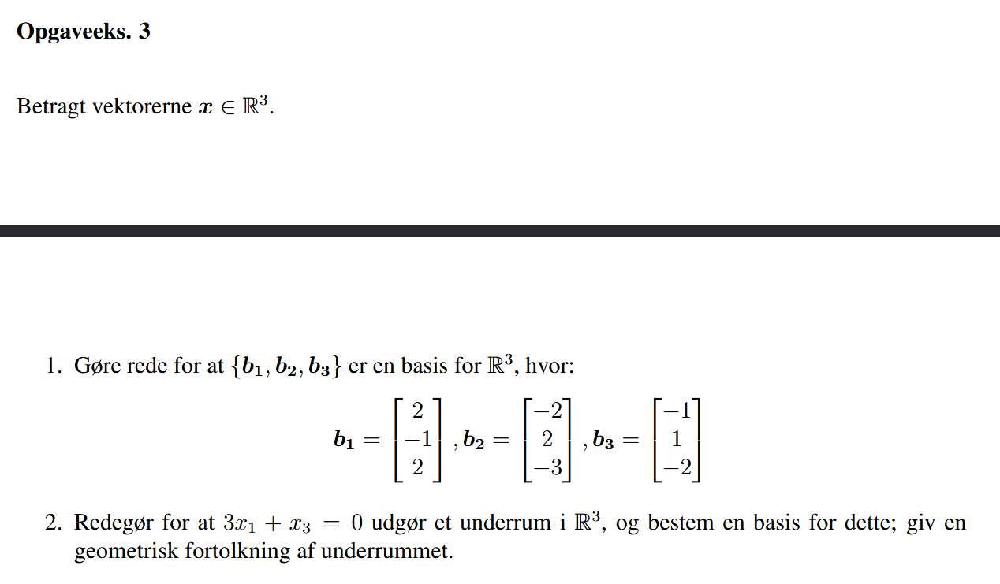

#### 1.
$$
\bold{b_1} =\begin{bmatrix} 2 \\ -1 \\ 2 \end{bmatrix},\:\bold{b2}=\begin{bmatrix} -2 \\ 2 \\ -3 \end{bmatrix}, \:\bold{b_3} = \begin{bmatrix} -1 \\ 1 \\ -2 \end{bmatrix}  
$$

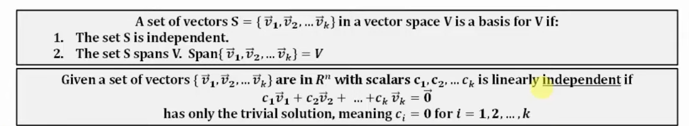

Opstil for b1, b2 og b3:

$$c_1\begin{bmatrix} 2 \\ -1 \\ 2 \end{bmatrix}+c_2\begin{bmatrix} -2 \\ 2\\ -3 \end{bmatrix} + c_3\begin{bmatrix} -1 \\ 1\\ -2 \end{bmatrix} =\begin{bmatrix} 0 \\ 0 \\ 0 \end{bmatrix} $$

Fuld augmenteret matrix hvorefter række reduktion:

$$
\begin{bmatrix} 2 & -2 & -1 & 0 \\
-1 & 2 & 1 & 0 \\
2 & -3 & -2 & 0 \\
\end{bmatrix}\Rightarrow
\begin{bmatrix} 1 & 0 & 0 & 0 \\
0 & 1 & 0 & 0 \\
0 & 0 & 1 & 0 \\
\end{bmatrix}
$$

Alle rækker har en pivot ergo er de alle linære uafhængige og derfor danner en basis for $\mathbb{R}^3$

```Matlab
%% Opgave 3

b1 = [2 -1 2]';
b2 = [-2 2 -3]';
b3 = [-1 1 -2]';
I = [0 0 0]';
M = [b1 b2 b3 I]; % Alle b er linæer indepedent og derfor danner de en basis for R^3;
```

#### 2.

Se svaret fra pdfen det meget udmærket!


### Opg 4

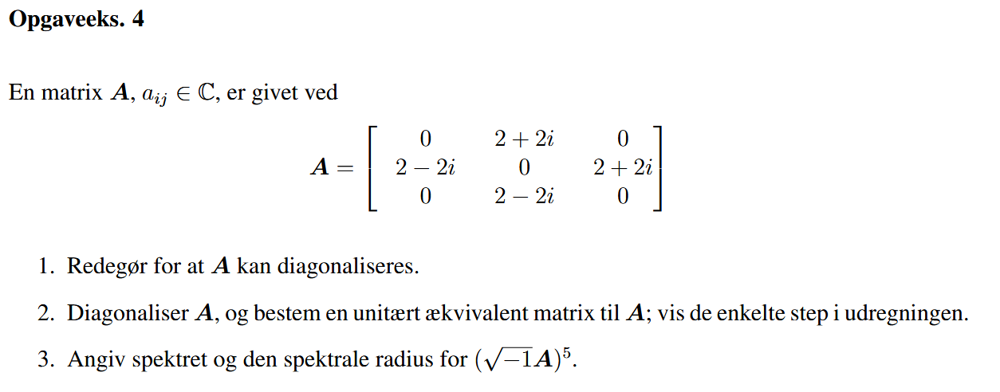


$$A = \begin{bmatrix} 0 & 2+2i & 0 \\ 2-2i & 0 & 2+2i \\ 0 & 2-2i & 0 \end{bmatrix}$$

#### 1.

For at diagonaliser så skal nogle? af de her 4 ting gælde:

1. n linearly independent eigen vectors
2. n distinct eigenvalues
3. sum of geometric multiplicities is n.
4. for each $\lambda$ geo. multiplicity = algebraic multiplicity

Men for den her gælder det at hvis: $A^HA = AA^H$ så kan den diagonaliseres.

Hvor $A^H=(*A^T)$ er dens conjugate transpose eksempel:

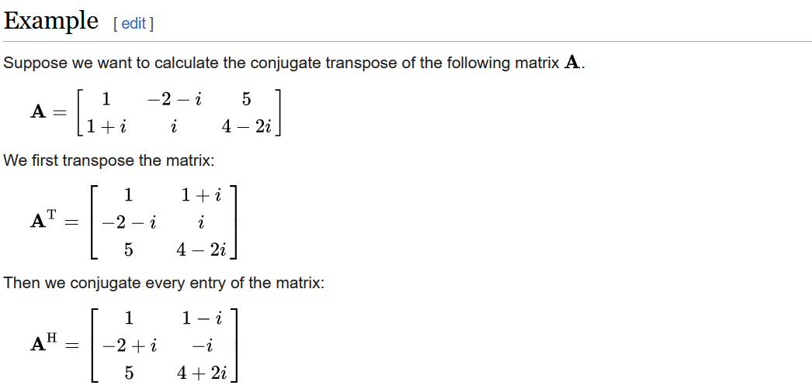

$$AA^H=\begin{bmatrix} 8 & 0 & 8i \\ 0 & 16 & 0 \\ -8i & 0 & 8 \end{bmatrix}\\ A^HA = \begin{bmatrix} 8 & 0 & 8i \\ 0 & 16 & 0 \\ -8i & 0 & 8 \end{bmatrix}$$

#### 2.

For at diagonaliser så skal man opnå for $A$: $D = U^{-1}AU$.
Hvor $U$ indeholder i sine søjler værdierne fra eigenvektorene: $\mathbf{u_1},\mathbf{u_2},\mathbf{u_3}$
Samtidig skal $\mathbf{D}$ have egenværdierne i sin diagonal.


$$det(\begin{bmatrix}0 & 2+2i & 0 \\ 2-2i & 0 & 2+2i \\ 0 & 2-2i & 0 \end{bmatrix} - \begin{bmatrix}\lambda & 0 & 0\\0 & \lambda & 0\\0 & 0 & \lambda\end{bmatrix}) = 0$$


$$\lambda_1 = -4, \: \lambda_2 =  0,\: \lambda_3 = 4$$

Løs for $\lambda_1$ eigenvector

$$\begin{bmatrix}-4 & 2+2i & 0 \\ 2-2i & -4 & 2+2i \\ 0 & 2-2i & -4 \end{bmatrix}
\begin{bmatrix}
    u_1 \\ u_2 \\ u_3
\end{bmatrix} = 0
$$

$$
\begin{bmatrix}-4u_1 & 2+2iu_2 & 0 & 0 \\ 2-2iu_1 & -4u_2 & 2+2iu_3 & 0 \\ 0 & 2-2iu_2 & -4u_3 & 0 \end{bmatrix}
$$

Her løses for de tre ligninger med de tre ubekendte.

$$
\mathbf{u_1} = [0 - 0.5i, 0.5+0.5i,-0.5]^T
$$

og for resten:

$$\mathbf{u_2}  = [0 - 0.707i, 0,0.707]^T $$

$$\mathbf{u_3}  = [0 - 0.5i,-0.5-0.5i,-0.5]^T $$
Derfor bliver $U = \begin{bmatrix} 0 - 0.5i & -0.707i&-0.5i\\ 0.5+0.5i & 0 & -0.5-0.5i\\-0.5 & 0.707 & -0.5 \end{bmatrix}$

Så for $\mathbf{D}$

$$U^{-1}AU = \mathbf{D} =\begin{bmatrix} -4 & 0 & 0 \\ 0 & 0 &0 \\ 0 & 0 & 4 \end{bmatrix}$$

Hvilket stemmer overens da eigenværdierne er i diagonalen!

#### 3.

Eftersom A er unitært ækvivalent med D så kan man erstatte A med D og dette giver værdierne for diagonalerne.

Spektret er deraf sættet: $[1024i,0,-1024i]$

Spektrale radius er så den maksimale værdi af skalarene fra settet: $1024$.


```Matlab
%% Opg 4
%% 1.
A = [0 2+i*2 0; 2-i*2 0 2+i*2; 0 2-i*2 0];
A'*A;
A*A';

% 2.
[vA, eA] = eig(A);
D = inv(vA) * A * vA

% 3
(sqrt(-1)*D).^5; 
```

### Opg 5

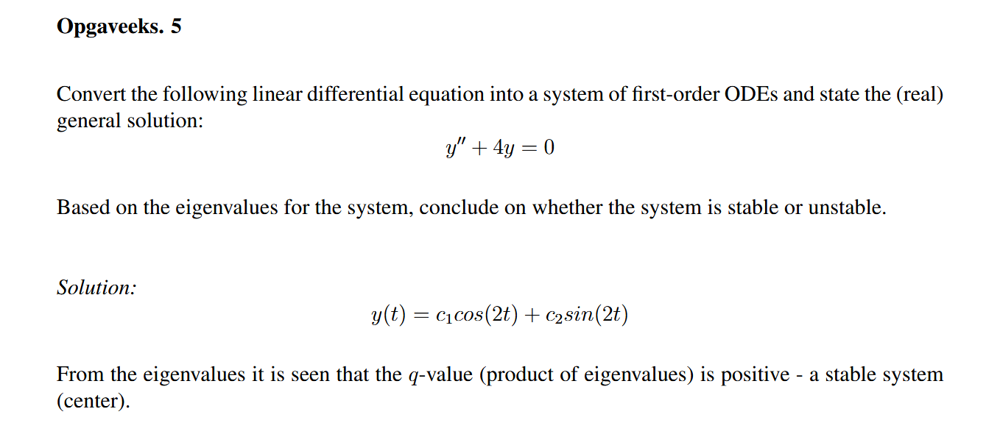

#### 1

\begin{equation}
    y'' + 4y = 0
\end{equation}


Stak af første ordens differential ligninger:


\begin{align*}
   y'_1 = f_1(y_1, y_2) = y_2 \\
   y'_2 = f_2(y_1, y_2) = -4y_1 
\end{align*}


Differential ligning på matrix form:

\begin{align*}
    \vec{y}\:'= \bf{A} \vec{y} = \begin{bmatrix}y_1' \\ y_2'\end{bmatrix} =
    \begin{bmatrix}
        0 & 1\\
        -4 & 0
    \end{bmatrix}\begin{bmatrix}y_1 \\ y_2\end{bmatrix}
\end{align*}


Den forventede løsning:
\begin{align*}
    y = C_1e^{\lambda_1}t + C_2e^{\lambda_2t}
\end{align*}

Løs for rødderne for at finde værdierne som skal ganges med t i den generelle løsnings.

\begin{align*}
    &y'' + 4y = 0 \\
    &r^2 + 4 = 0 \\
    &\mathrm{roots}\qquad r_1 = -2i \qquad r_2 = 2i
\end{align*}
Eftersom at tallene er imaginære $r_{1,2} = \lambda \pm \mu i$ så bliver det af formen:

\begin{align*}
    y(t) = c_1e^{\lambda t}cos(\mu t) + c_2e^{\lambda t}sin(\mu t)
\end{align*}

Indsæt rødderne:

\begin{align*}
    y(t) = c_1cos(2t) + c_2sin(2t)
\end{align*}

#### løsning af eigenvalues

\begin{align*} 
    det(\begin{bmatrix} 0 & 1 \\ -4 & 0 \end{bmatrix} - \lambda \bf{I}) = 0 \\
    det(\begin{bmatrix} -\lambda & 1 \\ -4 & -\lambda \end{bmatrix}) = 0 \\
    (-\lambda)(-\lambda) - (-4 \cdot 1) = 0 \\
    \lambda_1 = 2i  \qquad \lambda_2 = -2i
\end{align*}

Stable fordi (q): $2i \cdot -2i = 4$

```Matlab
syms r
test = r^2 + 4 == 0;
%solve(test,r);
A = [0 1; -4 0];
[vA eA] = eig(A);
%(2*i * (-2*i)); %4
```


### Opg 6

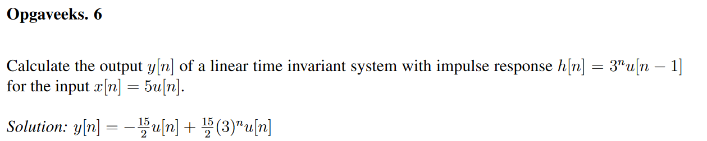

#### 1.

Først udregn z transformen af $h(n)$ og $x(n)$ hvorefter man ved for et LTI system at dette er givet: $H(z) = \frac{Y(z)}{X(z)}$ hvoraf man nu kan løse for $y(n)$ ved den inverse z-transform af $Y(z)$

$$h(n)=3^nu(n-1) = 3(3)^{n-1}u(n-1)\:\mathrm{gilli\:cook}$$


$$ 3 \cdot 3^{n - 1} = 3^{1 + n-1}$$


$$X(z) = Z(x(n)) = Z(5u(n)) = \frac{5z}{z-1}\\H(z) = Z(h(n)) = Z(3(3)^{n-1}u(n-1)) = \frac{3z^{-1}}{1-3z^{-1}}$$

$$Y(z) = H(z)\cdot X(z) = \frac{15z^{-1}}{(1-z^{-1})(1-3z^{-1})}\\=\frac{A_1}{1-z^{-1}} + \frac{A_2}{1-3z^{-1}}$$

$$A_1 = \left.(1-z^{-1})Y(z)\right\vert_{z=1}\\ =\left.\frac{15z^{-1}}{1-3z^{-1}}\right\vert_{z=1} = -15/2$$

$$A_2 = \left.(1-3z^{-1})Y(z)\right\vert_{z=3}\\ =\left.\frac{15z^{-1}}{1-z^{-1}}\right\vert_{z=3} = \frac{5}{1-1/3} = 15/2$$

$$Y(z)=\frac{-15/2}{(1-z^{-1})}+\frac{15/2}{(1-3z^{-1})} \qquad |z|>3$$


$$Z^{-1}(Y(z)) =y(n)=7.5(3)^nu(n) - 7.5u(n)$$


```Matlab
clear all; clc;
syms n integer
syms z u
u(n) = kroneckerDelta(n)/2 + heaviside(n);
h1(n) = (3.^n)*(u(n-1));
x1(n) = 5*u(n);
zu(z) = ztrans(u(n),z);
zh1(z) = partfrac(ztrans(h1(n),z));

%n = [-2: 0.5: 2]; %test for at om de er ens
%stem(n,h1(n));
%hold on
%stem(n,testh1(n));

zx1(z) = partfrac(ztrans(x1(n),z));
Y(z) = zh1(z)*zx1(z);
pretty(expand(Y(z))); %expand viser det ret godt
y1(n) = iztrans(Y(z),n);
vpa(partfrac(y1(n)));
%Svaret her mangler u(n) men det gør maple også så det er bare dejligt :)
```

### Opg 7
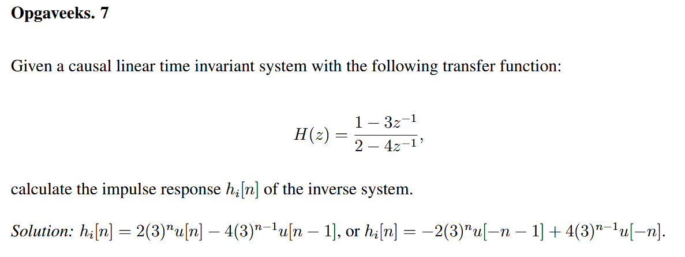

#### 1.

$$H(z) = \frac{1-3z^{-1}}{2-4z^{-1}} = \frac{1}{2} \cdot \frac{1-3z^{-1}}{1-z^{-1}}$$

Le Gilli: Since H(z) is the transfer function of causal system, its region of convergence extends outside the outermost pole, i.e ROC: $z>2$

Den inverse $H_i(z)$ er $\frac{1}{H(Z)}$.
Herefter kan man splitte $H(z)$ op til to brøker istedet og udføre $Z^{-1}$ transform så først inverse af $H(z)$:

$$H_i(z) = \frac{1}{H(z)}  =\frac{2-4z^{-1}}{1-3z^{-1}}$$

Delt op i brøker og tag inverse ztransform

$$Z^{-1}(H_i(z)) =Z^{-1}(\frac{2}{1-3z^{-1}} - \frac{4z^{-1}}{1-3z^{-1}})\\ $$

Le Gilli:The only region of convergence of $H_i(z)$ that overlaps with the region of convergence of H(z) is $|z|>3$

Herudfra kan man fra inspektion se at formen for dem begge er:

$$Z^{-1}(\frac{1}{1-az^{-1}}) = a^nu(n)\:\:\:|z|>|a|$$
Konstanterne i tælleren trækkes ud og $z^{-1}$ er timeshift property igen derfor bliver det til:

$$h_i(n) = 2(3)^nu(n) - 4(3)^{n-1}u(n-1) $$

### Opg 7.1

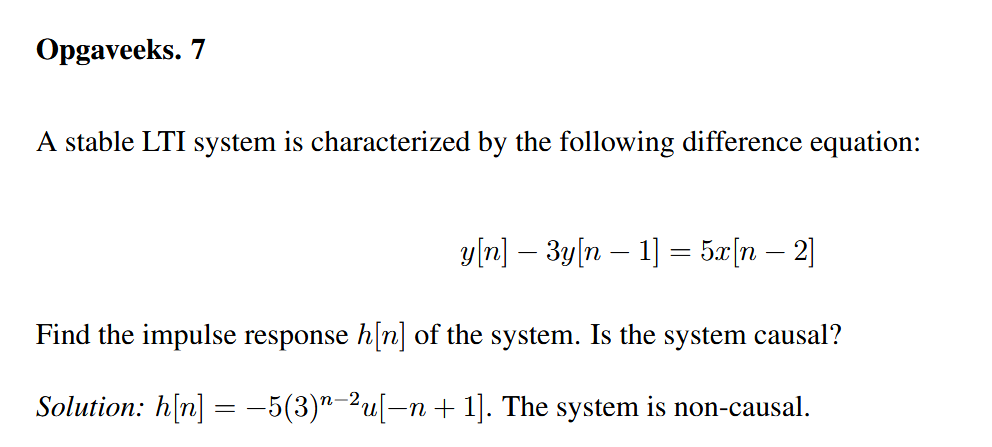

#### 1.

$$y[n]-3y[n-1] = 5x[n-2]$$

Transform det til z domænet.

$$Y[z]-3z^{-1}Y[z] = 5z^{-2}X[z]$$

Herefter find $H[z]$

$$H[z] = \frac{Y[z]}{X[z]} =\frac{5z^{-2}}{1-3z^{-1}} $$


Hernæst tag den inverse z transform af $H[z]$

Der bliver i opgaven givet at systemet er stabilt og en pol findes udfra overstående $H(z)$ hvilket giver at en sekvens gående mod venstre skal benyttes.

Dette skyldes at et system kun er stabilet hvis:

* An LTI system is stable if and only if the ROC of its system function H(z) includes the unit circle, |z| = 1
* Additionally for a causal system with rational system function H(z) is stable if all the poles of H(z) lie inside the unit circle i.e their magnitude $<1$

Her ses det udfra formen at $Z^{-1}(\frac{1}{1-az^{-1}}) = -a^nu[-n-1]$ fordi nu går systemet mod venstre altså ind mod 0 hvilket er nødvendigt for dette system grundet at det er stabilt. 

$5z^{-2}$ er henholdvis en konstant og en time delay hvilket giver at n bliver istedet $n-2$

Så ved inspektion giver det:

$$h[n] = -5(3)^{n-2}u[-(n-2)-1]\\ =-5(3)^{n-2}u[-n+1]$$

Systemet er non causal grundet $(-n+1)$ fordi det afhænger af fremtidige værdier hvor causal er for de tidligere værdier så i stedet ved fx. $n-1$

### Opg 8

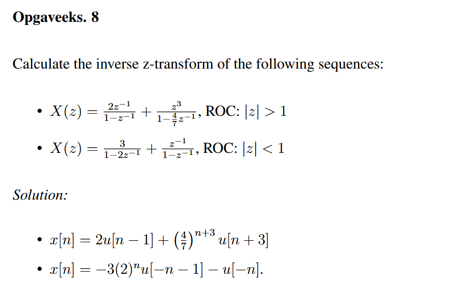

#### 1.

$$X(z) = \frac{2z^{-1}}{1-z^{-1}} + \frac{z^3}{1-4/7\cdot z^{-1}}$$

Så for den første del ved at bruge inspektion method kan man se at formen: $\frac{1}{1-z^{-1}}$ optræder hvilket inverse giver: $u[n]$ for ROC Z>1.
Konstanten i tælleren kan trækkes ud og det resterende: $z^{-1}$ kan løses for ved hjælp af time shifting property: $x[n-k]$ i Z-Domain:$z^{-k}X(z)$
Så der hvor n optræder skal k trækkes fra.
Deraf ved inspektion: $$Z^{-1}(\frac{2z^{-1}}{1-z^{-1}}) = 2u[n-1]$$

Den anden del ser man udfra inspektion at: $\frac{1}{1-az^{-1}}$ optræder hvilket giver: $a^nu[n]$ for ROC z>1.
Ellers er proceduren det samme som del 1:

$$Z^{-1}(\frac{z^3}{1-4/7\cdot z^{-1}}) = \frac{4}{7}^{n+3}u[n+3]$$

$$x[n] = 2u[n-1] + \frac{4}{7}^{n+3}u[n+3]$$


#### 2.

$$X(z) = \frac{3}{1-2z^{-1}} + \frac{z^{-1}}{1-z^{-1}}$$
ROC: $|z| < 1$

Nu med denne ROC så er $Z^{-1}(\frac{1}{1-az^{-1}}) = -a^nu[-n-1]$

Så for det første term: $$Z^{-1}(\frac{3}{1-2z^{-1}}) = -3(2)^nu[-n-1]$$

Det sidste term minder meget om den første men pga z < 1 nu så er den anderledes. 

Ergo bliver det til:

$$x[n] = -3(2)^nu[-n-1]-u[-n]$$