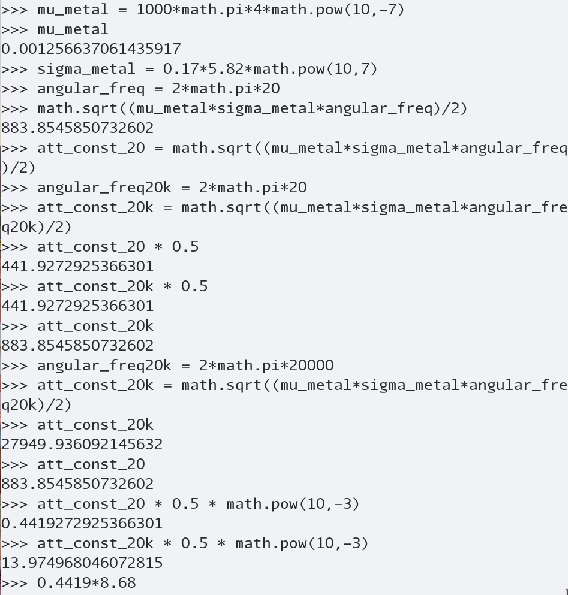
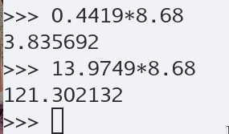

# Assignments lecture 6:

## exercise 16.1

Around the preamplifier for the CD input in a radio there is a screen of a general metal sheet of
thickness 0.5 mm (Medium constants are given at the end of the document).

### a. Calculate the attenuation due to the absorption of radiated noise fields with frequencies 20 – 20 kHz, expressed in dB.

to do this first we must find out attenuation konstant $\alpha = \frac{1}{\delta} = \sqrt{\frac{\omega \mu \sigma}{2}}$

With this formula and the values from the table below the attenuation konstant for 20 hz and 20 khz can be found

* remember that $\mu = \mu_0 \cdot \mu_r$ and $\sigma = \sigma_0 \cdot \sigma_r$

$$\alpha 20 = 883.8546 [\frac{Np}{m}]$$
$$\alpha 20k = 27949.936 [\frac{Np}{m}]$$

these can then be multiplied with the thickness of the metal sheet to gives us the attenuation in neper \[Np\]

$$\alpha 20 \cdot 0.5 \cdot 10^{-3} = 0.4419 [Np]$$
$$\alpha 20k \cdot 0.5 \cdot 10^{-3} = 13.9749 [Np]$$

now the neper can be calculated into db
1 neper equals 8.68 dB
$$0.4419 \cdot 8.68 = 3.835[dB]$$
$$13.9749 \cdot 8.68 = 121.3 [dB]$$

these calculation can offcourse also be done for any other frequency.


### b. Calculate the attenuation due to reflection across the electric field, expressed in dB. The calculation is carried out for 20 kHz and is calculated from the surface impedance. Both surfaces are included, absorption is not included.


### c. Calculate the phase shift a 20 kHz signal undergoes from front to back. Express the result in degrees.

just like assignment a, here we will calculate the phase propogation constant and then multiply it with the width of the metal sheet to get the phase shift in radians, these can then be converted into degrees

```{python}
import math

alpha = 13.9749

print(alpha * 180/math.pi)

```

800 deg phase shift


### material information
|material   | $\mu_r$ | $\sigma$ |
|-----------|---------|----------|
|$\mu$-metal|80.000   |   0,03   |
|aluminium  |    1    |   0,61   |
|metal sheet|1000     |   0,17   |

# Mellemregninger


