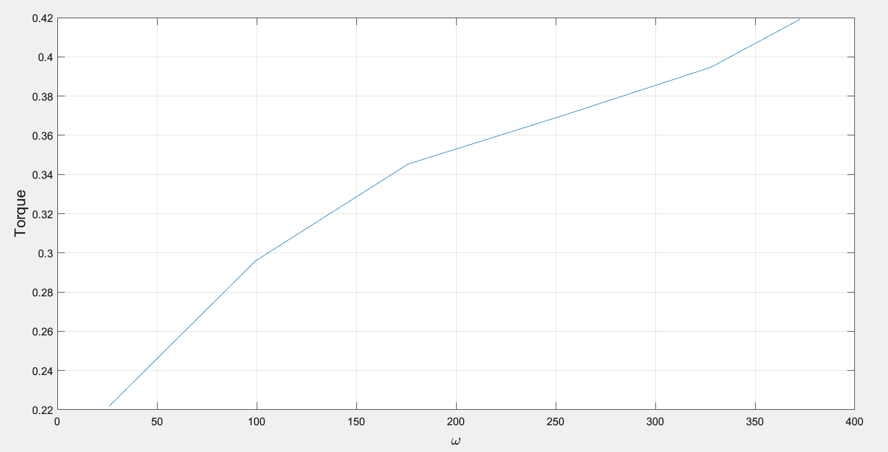

# Bestemmelse af motor parametere

## Resultater

$$R=2.08\Omega$$
$$L=44.93\mathrm{\mu H}$$
$$K_e = 4.68\cdot10^{-3}\mathrm{Vs}$$
$$K_t = 0.247 \frac{\mathrm{Nm}}{\mathrm{A}}$$
$$B = 0.526\cdot10^{-3}\mathrm{Nms}$$

### Resistance (R)

Spændingen skrues langsom op til lige inden motoren starter.
Herefter aflæses spændingen og strømmen til motoren for at beregne modstanden af motoren.

$$U = 2.5\mathrm{V}$$
$$I = 1.2\mathrm{A}$$
Det resulterer til:
$$R = \frac{U}{I} = 2.08\Omega$$

### Inductance (L)

Spænd bolten så motoren forbliver i stilstand.

Giv en $14\mathrm{V}$ step voltage til motoren aflæs strømkurven(grønne kurve) ved brug af tang amperet koblet til oscilloscopet.

**Scope indstillinger og måling:**


Aflæs maks strømmen ($22A$) udfra grafen og herefter udregn strømmen ved $63.2\mathrm{\%}$ som er $13.9\mathrm{A}$.

Derefter ses tidskontanten udfra grafen ved $13.9\mathrm{A}$ at den er $21.6\mu S$.
Herefter kan man udregne $L$ som er $44.93\mu H$ hvilket er givet af: $\tau = \frac{L}{R}\Leftrightarrow L = \tau\cdot R$ 


```Matlab
%% 1
%L
clear; close all;
[File1,Path1] = uigetfile('*.csv', '');
FullFile1 = fullfile(Path1,File1);
table1 = readtable(FullFile1);

plot(table1.Var1,table1.Var3);
grid on;
```
### Ke

Lad motoren køre frit ved forskellige spændinger og aflæs rotationer ved hjælp af tachometer.

Angular velocity er givet som:
$$\omega = RPM \cdot 2\cdot \frac{\pi}{60}$$

$K_e$ er givet som:

$$K_e = \frac{U-Ri}{\omega}$$

Tachometeret giver RPM som kan omregnes til $\omega$ og spændingen er givet fra strømforsyningen.
Resultaterne for $K_e$ kan se i tabellen:


| Voltage [V]| Current [A] | RPM | Angular velocity [rad/s]|$K_e$|
|---------|---------|----------|-|-|
|2.5|0.9|250|26.18|2.398783e-02|
|5|1.2|950| 99.48|2.516994e-02|
|7.5|1.4|1680| 175.92|2.607867e-02|
|10|1.5|2420| 253.421|2.714841e-02|
|12.5|1.6|3130|327.77 |2.798279e-02|
|14|1.7|3560| 372.49 |2.806849e-02|

Matlab beregninger:
```Matlab
%% 2
close all; clear;
R = 2.08;
RPM = [250 950 1680 2420 3130 3560];
U = [2.5 5 7.5 10 12.5 14];
current = [0.9 1.2 1.4 1.5 1.6 1.7];
for i = 1:length(RPM)
    angular(i) = (RPM(i) * 2 * pi)/60;
end

for k = 1:length(U)
    Ke(k) = (U(k)-(R*current(k)))/(angular(k));
end
fprintf('Angular %d,\n', angular);
fprintf('Ke %d,\n', Ke);
```

### Kt and B

Indstil bolten så det bremser motoren og derefter aflæs spændingen fra torquemeter gradvist ved forskellige spændings intervaller fra strømforsyningen til motoren.

Newton meter relation til spænding for motoren: $10\mathrm{Nm} = 5.001\mathrm{V}$

Torque findes som:

$$\frac{\mathrm{meassured\:\: voltage}}{\mathrm{torquemeter\:\: voltage}}\cdot\mathrm{torquemeter\:\: Nm}$$

$K_t$ er
$$
\frac{\mathrm{torque}}{current}
$$

Dernæst lader vi motoren køre frit ved forskellige RPMs og finder $B$ ved hældningen af torque vs angular velocity plot.

| Voltage [V] | Current [A] | Newton/meter voltage | Torque [Nm]|$K_t [\frac{\mathrm{Nm}}{\mathrm{A}}$]|
|---------|---------|----------------------|-|-|
|1|0.3|30mV|0.059|0.199|
|2|0.9|60mV|0.119|0.133|
|3|2.1|200mV|0.399|0.190|
|4|4.1|500mV|0.999|0.243|
|5|6|770mV|1.539|0.256|
|6|8.4|1.1V|2.199|0.261|
|7|10.6|1.37V|2.739|0.258|
|8|12.7|1.68V|3.359|0.264|
|9|14.6|2V|3.999|0.273|
|10|16.8|2.3V|4.599|0.273|
|11|18.6|2.56V|5.118|0.275|
|12|20.1|2.76V|5.518|0.274|
|13|20.5|2.88V|5.758|0.281|
|14|24.2|3.22V|6.438|0.266|

Plot:



Matlab beregninger:
```Matlab
%% 3
close all; clear;
current = [0.3 0.9 2.1 4.1 6 8.4 10.6 12.7 14.6 16.8 18.6 20.1 20.5 24.2];
torquevol = 5.001;
torqueconstant = 10;
torquevoltage = [30E-3 60E-3 200E-3 500E-3 770E-3 1.1 1.37 1.68 2 2.3 2.56 2.76 2.88 3.22];
for i = 1:length(torquevoltage)
   torque(i) = (torquevoltage(i)/ torquevol) * torqueconstant
end
fprintf('torque %d,\n',torque)
Ktarray = torque./current
Kt = mean(Ktarray)

% calculate b
current_b = [0.9 1.2 1.4 1.5 1.6 1.7];
RPM_b = [250 950 1680 2420 3130 3560];
for i = 1:length(RPM_b)
    angular(i) = (RPM_b(i) * 2 * pi)/60;
end
torque_b = current_b .* Kt
plot(angular,torque_b);
xlabel('\omega','FontSize',14);
ylabel('Torque','FontSize',14);
f = polyfit(angular, torque_b, 1);
b = f(1)
grid on;
```