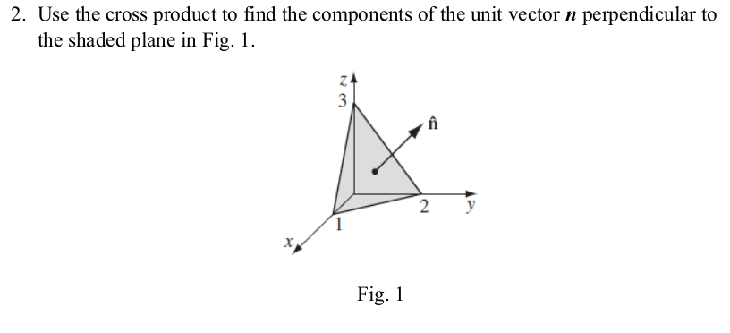
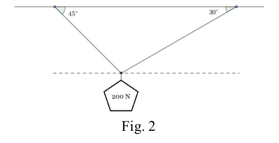

# Exercise 1

Is the cross product associative?

Associative means if the order of operations matter.
No.
Imagine three vectors A(1,0) and B(0,1) and C(0,-1).
If the cross product of A B is taken first, it will generate a normal vector which is orthogonal to C and then a cross product with a positive amplitude is calculated, but if B and C is calculated first, since they are parallel, they will generate a vector of length 0, and then the final result will be a zero vector.

# Exercise 2



$$
\vec{A} = \hat{x} - 2 \hat{y} \\
\vec{B} = \hat{x} - 3 \hat{z}
$$

**Result:**
$$
\vec{n} = \vec{A} \times \vec{B} = 6 \hat{i} + 3 \hat{j} + 2 \hat{k} \\
\hat{n} = \frac{\vec{n}}{|\vec{n}|} = 0.85714286\hat{i} + 0.42857143\hat{j} + 0.28571429\hat{k}
$$

**Calculation:**
```py
import numpy as np
A = np.asarray([1, -2, 0])
B = np.asarray([1, 0, -3])
n = np.cross(A,B)
print(n)
n_hat = n/np.linalg.norm(n)
print(n_hat)
```
**Output:**
```py
array([6, 3, 2])
array([0.85714286, 0.42857143, 0.28571429])
```

# Exercise 3

For each of the following, find a vector which satisfies the given conditions.

a. A unit vector which is in the opposite direction of $\vec{v}=3\hat{i} + 4\hat{j}$.

$$
-\frac{\vec{v}}{|\vec{v}|}=-0.6\hat{i} - 0.8\hat{j}
$$

b. A unit vector which is in the same direction from $P_1(1,0,5)$ to $P_2(3,-1,2)$..

$$
\vec{v} = P_2 - P_1 = 2\hat{i} - 1\hat{j} - 3\hat{k}
$$

c. A vector which is in the opposite direction of $\vec{v} = [1,2,3]$ and whose magnitude is half that of $\vec{v}$.

$$
\frac{\vec{v}}{2} = [0.5, 1, 1.5]
$$

d. A vector which is in the same direction of $\vec{w} = \hat{i} - 2\hat{j} + 3\hat{k}$ and which has a length of 2.

**Result:**
$$
|\vec{w}| = 0.53452248\hat{i} -1.06904497\hat{j} + 1.60356745\hat{k}
$$
**Calculation:**
```py
import numpy as np
w = np.asarray([1,-2,3])
v = 2 * w / np.linalg.norm(w)
print(f"{v=}")
```
**Output:**
```py
v=array([ 0.53452248, -1.06904497,  1.60356745])
```

e. A vector in 2-space which makes an angle of $\theta = \pi / 6$ with the positive $x$-axis and which has a magnitude of 4.

Just do it in polar coordinates like Igor (chaddington) would do.

# Exercise 4
A weight of 200 Newtons (N) is being supported by two wires, as shown in Fig. 2. Find the tension in each wire. (Assume that the system is in equilibrium)


