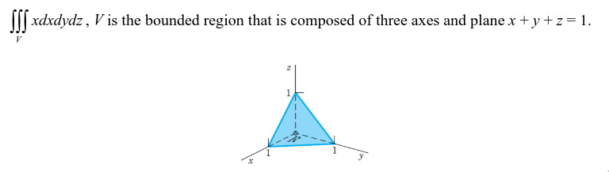
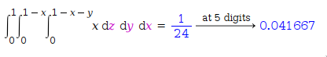

# assignments

## calculate these tripple intgrals

### 1

it is known that,
$ x+y+z=1 $
therefor we can isolate
$ 1-x-y=z $

$ \int_{0}^{1}\int_{0}^{1-x}\int_{0}^{1-x-y} x dx dy dz $

then we just solve the integral from inside out

$\int_{0}^{1-x-y} x dx dy dz → x\cdot z \vert_{0}^{1-x-y}$

